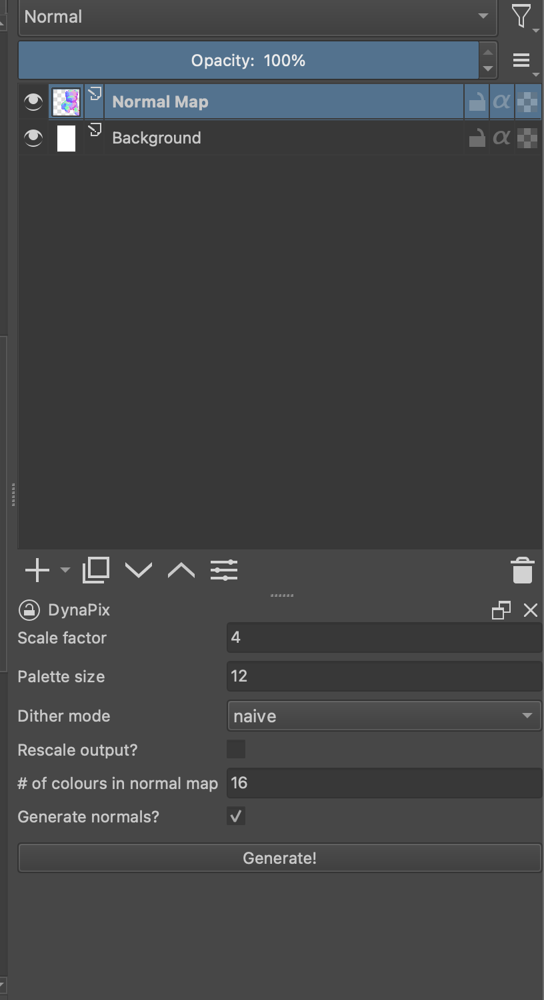

# DynaPix
DynaPix is build as an extension built for Krita, a free image editing tool used by many artists. Our tool enables artists to quickly create pixel art from high resolution images. Moreover, the tool was created with the aim in specifically aiding pixel artists to create assets for pixel-art based games. Therefore, our extension uses XT-Consistency to generate a normal map from a specified object in an image. The pixelization engine used is Pyxelate.

XT-Consistency and Pyxelate are open source and freely available projects. Please check them out for more details!

XT-Consistency -> https://github.com/EPFL-VILAB/XTConsistency

Pyxelate -> https://github.com/sedthh/pyxelate

## For a quick description and demo of our application please see our video linked below!

## How to run the project

The extension has primarily been tested on MacOS but the Linux version should work just as well.

You can get the project running in the following steps.

1. First install and run Krita for the first time before continuing. Krita will need to setup some folders that we will write to. Once Krita is running, go to *Settings > Manage Resources* and click on *Open Resources Folder*. Create a folder called `pykrita` if one does not already exist. Your file structure should look like the following...

2. Clone the repo into any directory on your machine: `$ git clone https://github.com/gerardogandeaga/CMPT461-ImagePixelizer`

3. cd into the root of the project directory denoted as`$REPO` and then cd into the `krita/` folder.

4. The project is only supported with Python 3.9 due to compatibility issues we faced during developement. Create a new Python virtual environment called `deps/` with the following command: `$ python3.9 -m venv deps`. Again, make sure you are running this from the `$REPO/krita/` directory.

5. From the `$REPO/krita/` directory, activate the virtual environment with `source ./deps/bin/activate` and install the required dependecies using `$ pip install -r requirements.txt`

6. Now that the dependencies are install you can deploy the extension. Using the `deploy_extension` script run `$ deploy_extension mac` if you're on mac or `$ deploy_extension linux` if you're on linux. The virtual environment and source could should be copied to the krita resources directory and be ready for usage. The project should show up in the `pykrita/` folder we created.

7. Lastly, to enable the project in Krita. Restart Krita, go to *Preferences > Python Plugin Manager*. There should be an entry called DynaPix. Tick the checkbox to enable it and restart Krita once more.

If the project was successfully deployed a docker should be visible on the right panel like so...

If you're unable to see it, you might need to either remove the other dockers or go to *Settings > Dockers* and select DynaPix. If it still does not show then please return to the python plugin manager menu and ensure that the DynaPix entry is not grayed out. If so, there was an internal error.

## Known Issues

* The extension seems to break once you delete a document in Krita. If you want to continouly create pixelated image avoid closing a document or you will need to restart Krita. There is no current fix for this :(
